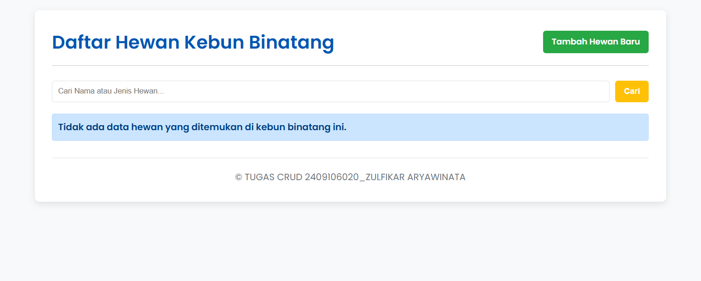
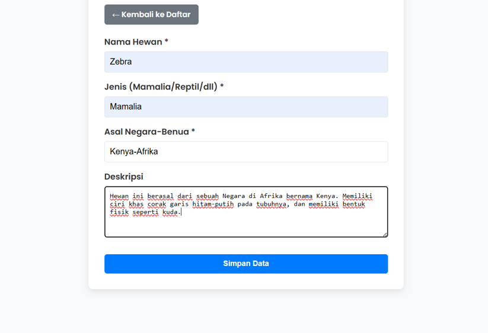
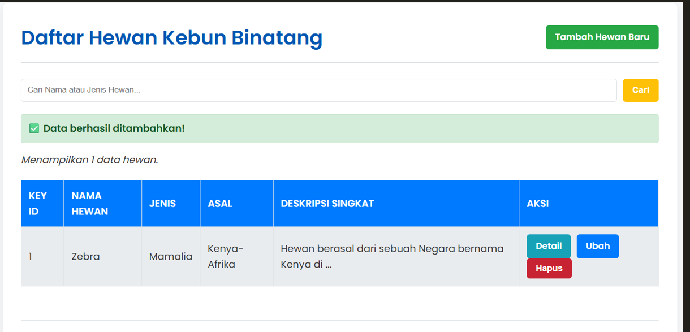
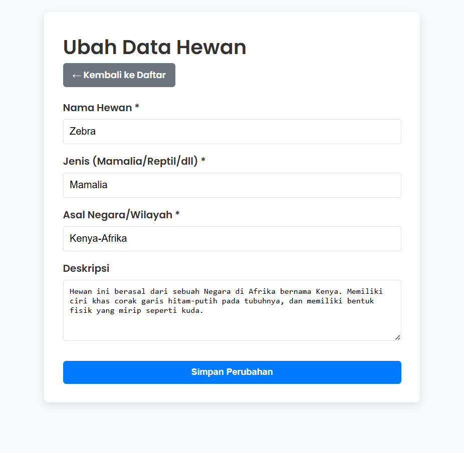
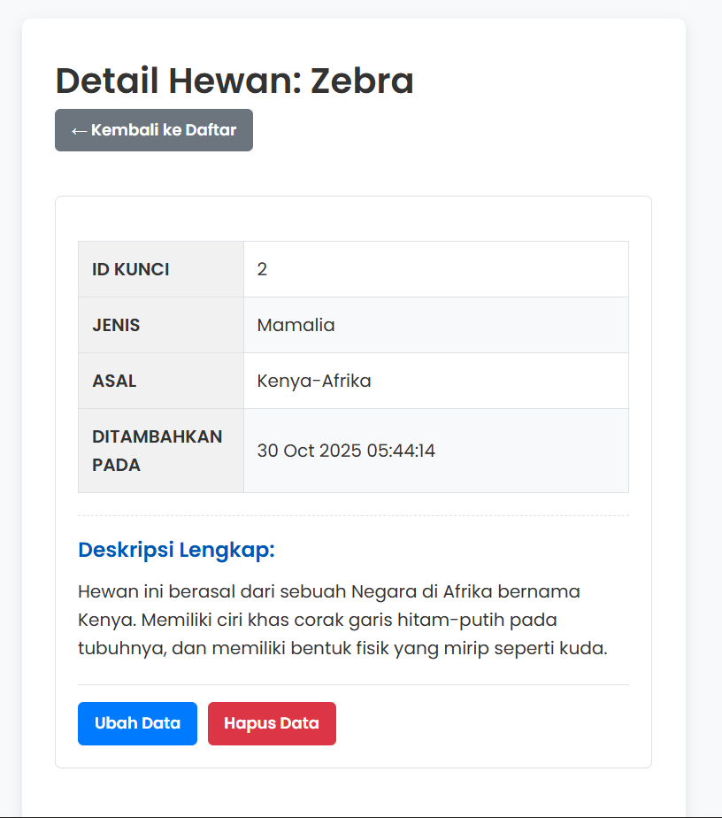
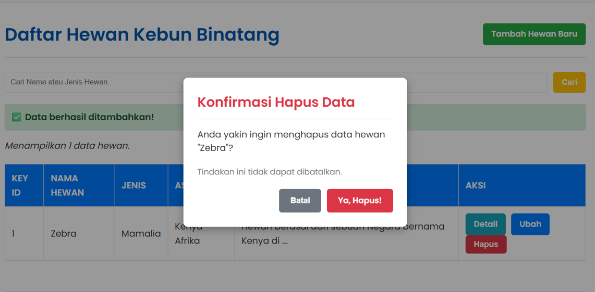
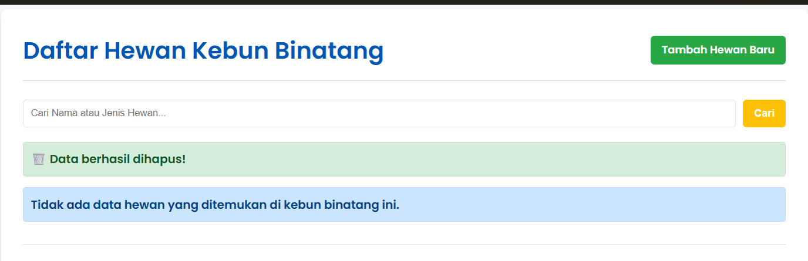
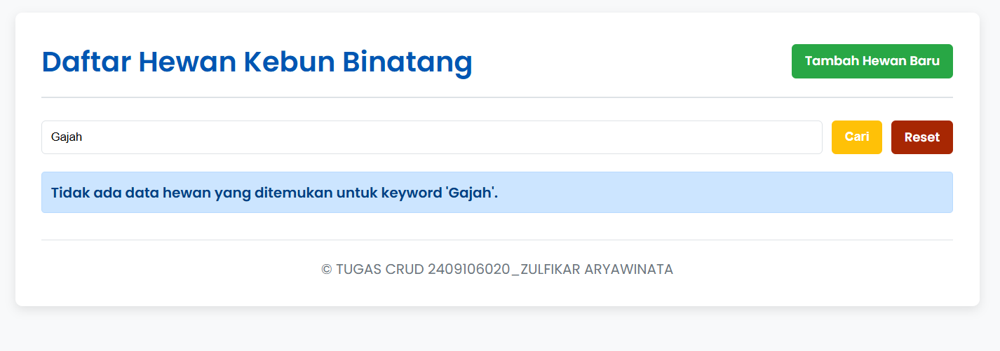

**Daftar Hewan Kebun Binatang:**
Aplikasi sederhana untuk mengelola daftar koleksi hewan yang ada di kebun binatang. Dibangun menggunakan PHP native dan koneksi database yang aman (PDO) tanpa menggunakan framework atau ORM.

**Fitur yang Tersedia:**
Aplikasi ini menyediakan fungsi dasar Create, Read, Update, dan Delete (CRUD) lengkap dengan fitur-fitur pendukung:
-Create (Tambah): Form untuk menambahkan data hewan baru (Nama, Jenis, Asal, Deskripsi).
-Read (Tampil): Menampilkan semua data hewan dalam bentuk tabel yang diurutkan berdasarkan waktu penambahan terbaru (created_at DESC).
-Read Detail: Halaman terpisah untuk melihat detail lengkap setiap item.
-Update (Ubah): Form edit data dengan prefill (data lama) yang dimuat dari database.
-Delete (Hapus): Tombol hapus interaktif.
-Pencarian: Fitur pencarian data berdasarkan kolom Nama dan Jenis hewan.
-Pagination: Pembatasan tampilan data, menampilkan maksimal 5 data per halaman.
-Keamanan: Menggunakan PDO Prepared Statements untuk menghindari serangan SQL Injection dan htmlspecialchars() untuk mencegah XSS.

**Kebutuhan Sistem:**
Untuk menjalankan aplikasi ini di lingkungan lokal Anda, pastikan Anda memiliki prasyarat berikut:
-Web Server: XAMPP, Laragon, WAMP, atau server lain yang mendukung PHP dan MySQL.
-PHP: Minimal PHP 8.0 atau versi yang lebih baru.
-Database: MySQL atau MariaDB.
-Ekstensi PHP: Pastikan ekstensi PDO aktif (biasanya sudah aktif secara default).

**Cara Instalasi dan Konfigurasi:**
Ikuti langkah-langkah berikut untuk menjalankan aplikasi:
1. Kloning/Unduh Proyek
Tempatkan semua file PHP dan CSS ke dalam direktori web server Laragon Anda (biasanya: C:\laragon\www\kebun_binatang).

2. Konfigurasi Database
-Pastikan MySQL/MariaDB sudah berjalan di Laragon.
-Buka aplikasi MySQL Workbench, DBeaver, HeidiSQL, phpMyAdmin, Navicat for MySQL, atau yang lainnya(tergantung anda memakai aplikasi apa).
-Lalu buka script SQL yang telah disimpan bersama file PHP dan CSS di aplikasi yang anda gunakan.
-Jalankan query SQL berikut untuk membuat dan memakai database yang telah dibuat: 
CREATE DATABASE `db_kebun_binatang`;
USE `db_kebun_binatang`;
Lalu jalankan query SQL berikut untuk membuat tabel hewan:
CREATE TABLE `hewan` (
  `id` INT(11) NOT NULL AUTO_INCREMENT,
  `nama` VARCHAR(100) NOT NULL,
  `jenis` VARCHAR(50) NOT NULL,
  `asal` VARCHAR(50) NOT NULL,
  `deskripsi` TEXT,
  `created_at` TIMESTAMP NOT NULL DEFAULT CURRENT_TIMESTAMP,
  PRIMARY KEY (`id`)
);

3. Konfigurasi Koneksi
Buka file koneksi.php dan pastikan detail koneksi database sesuai dengan konfigurasi default Laragon. Jika Anda tidak mengubah pengaturan default Laragon, konfigurasi ini sudah benar:

// File: koneksi.php
$host = 'localhost';
$db   = 'db_kebun_binatang';
$user = 'root'; 
$pass = '';     // Laragon default password MySQL/MariaDB biasanya kosong
// ...

4. Jalankan Aplikasi
Akses aplikasi melalui browser Anda. Jika Anda menggunakan Virtual Host bawaan Laragon (misalnya kebun_binatang.test), akses melalui URL tersebut. Jika tidak, akses melalui http://localhost/kebun_binatang/.

**Struktur Folder:**
```
kebun_binatang/
├── gambar
  ├── halamanutama.png
  ├── tambahdata.png
  ...
├── index.php      # READ (Daftar, Pagination, Pencarian)
├── tambah.php     # CREATE (Form Tambah)
├── ubah.php       # UPDATE (Form Edit)
├── hapus.php      # DELETE (Logika Hapus)
├── detail.php     # READ DETAIL
├── koneksi.php    # Konfigurasi Koneksi PDO
├── style.css      # Styling
└── README.md
```

**Contoh Environment Config:**
Aplikasi ini tidak memerlukan file .env terpisah, namun konfigurasi utama terdapat pada file koneksi.php 
yang berisi variabel-variabel berikut:
// File: koneksi.php
$host = 'localhost';
$db   = 'db_kebun_binatang';
$user = 'root';
$pass = '';

**Screenshot Aplikasi :**







